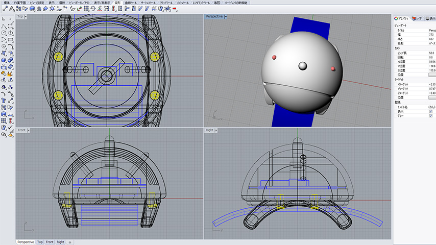

# POLLEN_WATCH

## ポールンウォッチって？

ウェアラブルなくしゃみカウンターです。  
腕時計のように身につけ、くしゃみのたびにポールンウォッチの鼻のボタンをポチッと押すと、あなたのくしゃみの回数とその時間を記録。くしゃみの回数に応じて目も光ります。  
ウェザーニュースタッチの花粉Ch.にある専用ページから、ポールンウォッチに記録されたデータを読み込みます。  
花粉シーズン中のあなたのくしゃみデータが記録され、くしゃみの回数の変化が見られるようになります。  
[ウェザーニュース タッチ](https://itunes.apple.com/jp/app/u-ezanyusu-tatchi/id302955766?mt=8)

## 公開データ

* 回路図・基板作成用ガバーデータ

* 筐体3Dデータ STL

* ファームウェア

* 取扱説明書 PDF

※2015年版については、iPhone4S以降のみ対応

※製品段階の最終データになります。  
　作り方によっては精度が出ない場合もあります。

※作り方の詳細は[wiki](https://github.com/weathernews/POLLEN_WATCH/wiki)に用意していきます。

## ポールンウォッチ利用規約

株式会社ウェザーニューズ（以下、「当社」という。）は、ポールンウォッチの3Dデータ・基板データ・ファームウェアを個人の方が利用出来るように公開いたします。

* 著作権の扱い  
ポールンウォッチの著作権は株式会社ウェザーニューズ（以下「当社」という）に帰属します。 
* 利用規約の変更  
当社は、あらかじめ利用者の皆様に通知することなく、いつでも、当社の運営するウェブサイト内に最新の利用規約を掲載することにより、本規約を変更できるものとします。ご利用の際には、随時、最新の利用規約をご確認下さい。
* 免責  
ポールンウォッチの3Dデータ・基板データ・ファームウェアの利用は、全て利用者の責任において行うものとし、あらゆるトラブル・不具合・不利益につき、当社は一切の責任を負いかねます。 

## 協力企業様

製作にあたり、  
企画・ファームウェア開発でマクニカ様  
筐体量産・基板作成でピーダブルビー様にご協力いただきました。  

* [株式会社マクニカ](http://www.macnica.co.jp/)

* [株式会社ピーダブルビー](http://www.pwb.co.jp/)

